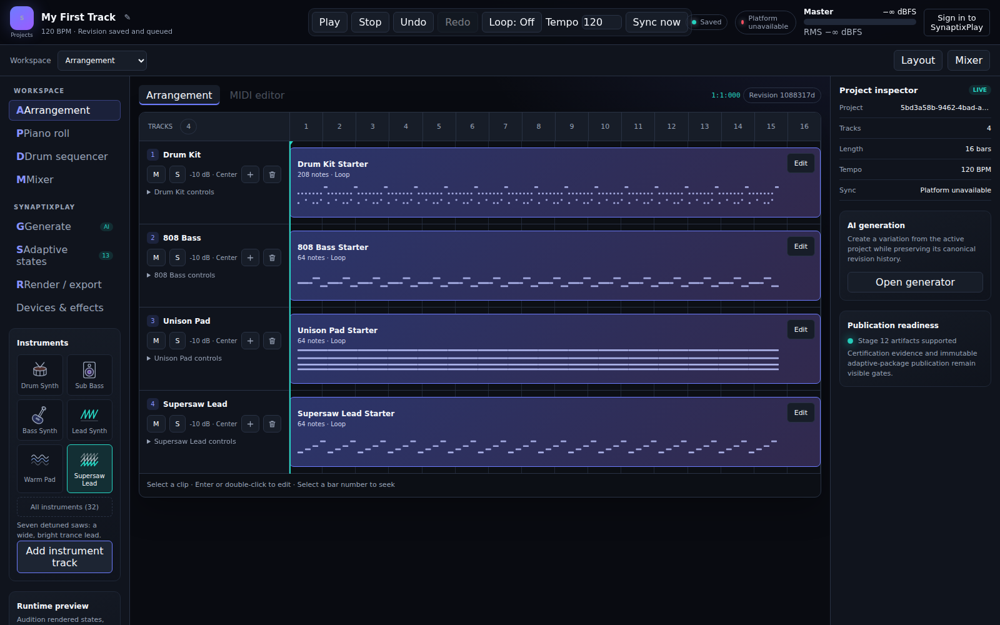
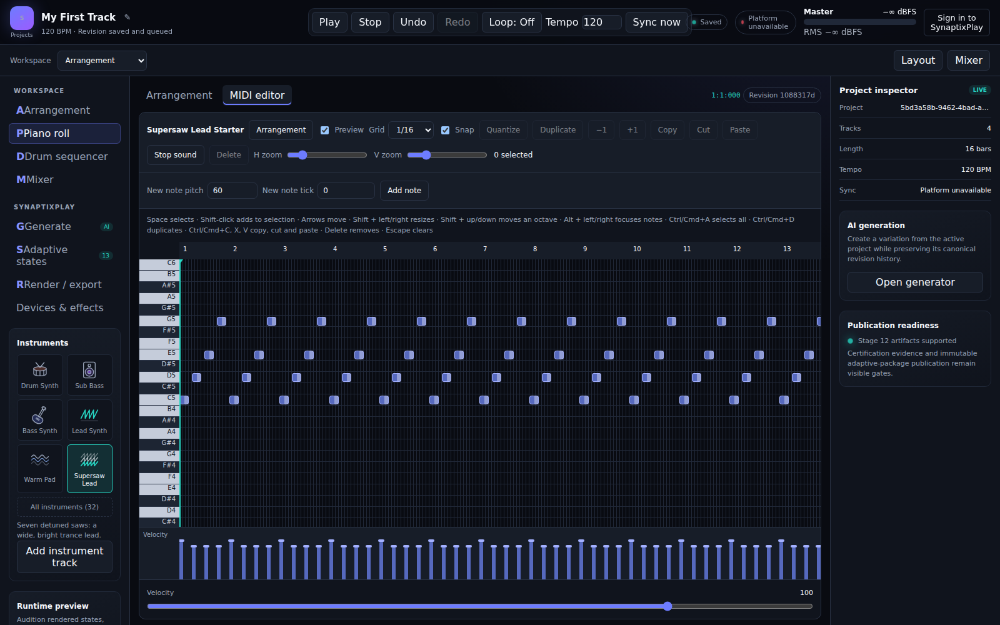
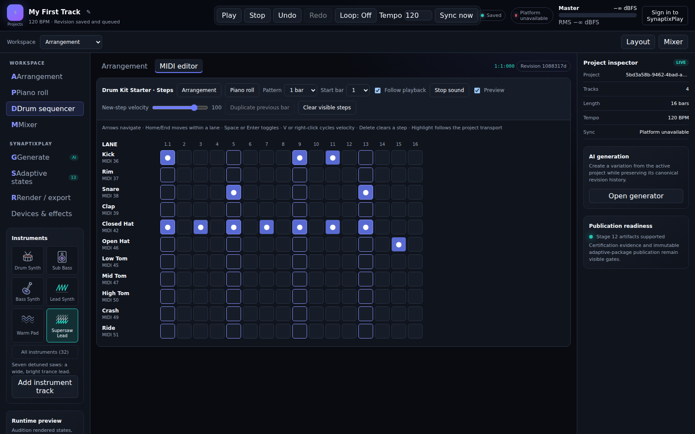
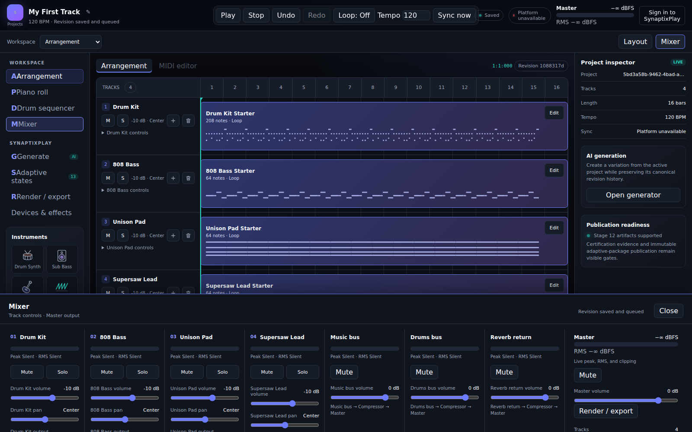

# Synaptix Music

Synaptix Music is the multi-runtime music-production system for **SynaptixPlay**. It combines a browser DAW, deterministic procedural composition, local-first project persistence, SynaptixPlay platform synchronization, production-oriented audio routing, and versioned render contracts.

The product is intentionally narrower than a general-purpose desktop DAW. Its primary use cases are editable generated music, trivia and game-show loops, stingers, adaptive music states, and creator-safe exports.

## The Studio



| Piano roll                                          | Drum sequencer                                                | Mixer                                            |
| --------------------------------------------------- | ------------------------------------------------------------- | ------------------------------------------------ |
|  |  |  |

More screens, and notes on the current layout, are in the [studio UI baseline](docs/plans/ui/studio-ui-baseline-2026-10.md).

## Current Capabilities

The repository currently provides:

- A Next.js/React browser studio with arrangement, piano-roll, and drum-step-sequencer workflows, and a DAW layout preview (Studio UI v2): an instrument browser, a bottom dock with the piano roll, device chain and mixer, a coloured timeline with markers and a loop brace, an adaptive states grid, and Generate and Export as a drawer and a dialog
- A 32-instrument catalog synthesized by a Rust kernel (compiled to WebAssembly) in both the render worker and the studio preview: band-limited oscillators, supersaw, Karplus–Strong, FM, drum kit, 808, noise and chip voices, with a resonant filter, modulation and stereo spread
- Command-backed mixer, transport, MIDI-note, quantization, transposition, duplication, and drum-step editing
- Bounded browser undo/redo, keyboard shortcuts, persistence recovery, and multi-tab editing protection
- Tone.js MIDI scheduling, device-aware synthesis, note audition, panic/all-notes-off, and authoritative transport ticks
- A strict canonical project schema shared across TypeScript/Zod, JSON Schema, and Python/Pydantic
- Immutable checksummed project revisions and deterministic command transactions
- IndexedDB local storage, immutable revision history, offline synchronization queueing, and cloud conflict resolution
- SynaptixPlay BFF and .NET platform APIs for durable project synchronization and generation-job lifecycle delivery
- A deterministic Python/FastAPI procedural generator for electronic trivia and game-show arrangements
- Production audio profiles, drum/music buses, shared effects, master compression, peak/RMS metering, and clipping evidence
- Versioned deterministic render request and result contracts
- Reproducible TypeScript, Python, Rust, Docker, and GitHub Actions toolchains

## Architecture at a Glance

| Layer                | Primary technology                               | Responsibility                                                                         |
| -------------------- | ------------------------------------------------ | -------------------------------------------------------------------------------------- |
| Studio application   | Next.js, React, TypeScript                       | Arrangement, piano roll, step sequencer, mixer, project lifecycle, BFF routes          |
| Browser audio        | Tone.js, Web Audio                               | Preview transport, scheduling, synthesis, buses, effects, audition, and metering       |
| DAW domain           | Framework-neutral TypeScript packages            | Canonical model, commands, revisions, storage, platform and render contracts           |
| Generation           | Python, FastAPI                                  | Deterministic procedural composition and future private model inference                |
| Platform integration | Next.js BFF and SynaptixPlay .NET API            | Identity, authorization, durable jobs, project synchronization, audit, and concurrency |
| DSP acceleration     | Rust, WebAssembly                                | Profile-driven future DSP kernels where measured bottlenecks justify them              |
| Production rendering | Background workers and FFmpeg-compatible tooling | Deterministic WAV-first rendering, stems, previews, and adaptive exports               |

## Repository Layout

```text
Synaptix_Music/
├── apps/music-studio/          # Next.js browser studio and BFF routes
├── packages/
│   ├── project-model/          # Canonical schema v1
│   ├── command-system/        # Commands, transactions, history, revisions
│   ├── project-storage/       # IndexedDB, hybrid repository, offline sync queue
│   ├── generator-contracts/   # Generation proposals and canonical conversion
│   ├── platform-contracts/    # SynaptixPlay API and lifecycle contracts
│   ├── daw-engine/            # Transport, scheduling, production audio graph
│   ├── render-contracts/      # Deterministic render manifests and results
│   └── shared-types/          # Cross-package shared types
├── services/generation-api/   # Python/FastAPI procedural generator
├── services/render-worker/    # Production-render worker boundary
├── crates/                    # Rust DSP and WASM bindings
├── schemas/                   # Cross-runtime schemas and fixtures
├── infrastructure/            # Docker and deployment support
├── docs/                      # Architecture, ADRs, plans, development, releases
└── .github/                   # CI and repository automation
```

## Supported Toolchain

- Node.js `22.14.0`
- npm `11.4.2`
- Python `3.12.4`
- Rust `1.88.0`
- Docker with Docker Compose

## Run Locally

To run the repository's services on Docker Desktop, start Docker Desktop in Linux
container mode, then run this from Git Bash, WSL, macOS, or Linux:

```sh
sh run-local.sh
```

Open <http://localhost:3000> to launch the demo studio or resume a local project. The script builds and starts the
studio, generation API, render worker, PostgreSQL, Redis, and MinIO. It creates
`.env.docker` for local settings; no host Node.js or Python installation is needed.
Use `sh run-local.sh logs` to follow logs and `sh run-local.sh down` to stop
containers while preserving data. See [Docker Desktop setup](docs/development/local-development.md#run-the-local-stack-on-docker-desktop)
for configuration and the separate SynaptixPlay platform requirements.

Alternatively, run the studio directly on your host:

```bash
git clone https://github.com/devartblake/Synaptix_Music.git
cd Synaptix_Music
npm install --global npm@11.4.2
npm ci --no-audit --no-fund
npm run dev
```

Open:

```text
http://localhost:3000/studio/local-demo
```

For cloud synchronization, configure:

```env
SYNAPTIX_PLATFORM_API_URL=http://localhost:8080
# Project schema the platform accepts for revision uploads (1 or 2; default 1 when unset).
# 2 uploads every revision as v2, including plug-in projects (needs a backend that validates v2).
# 1 uploads plain projects as v1 and keeps plug-in projects local-only.
NEXT_PUBLIC_SYNAPTIX_PLATFORM_PROJECT_SCHEMA_VERSION=2
```

The browser studio remains locally usable when the platform API is unavailable. IndexedDB persistence, editing, transport, and preview audio do not require PostgreSQL or Redis.

Start the Python generation API separately when needed:

```bash
cd services/generation-api
python -m venv .venv
source .venv/bin/activate   # Windows: .venv\Scripts\Activate.ps1
python -m pip install -e ".[dev]"
uvicorn app.main:app --reload --host 127.0.0.1 --port 8100
```

See [Local development](docs/development/local-development.md) for the complete Windows, Linux, Docker, and platform setup.

## Validation

```bash
npm run ci
```

CI independently validates TypeScript, Python, Rust/WASM, and Docker Compose.

## Current Development Stage

Stages 1–11 are complete. **Stage 12 — Production Audio and Rendering** is complete and accepted (local certification evidence, 2026-09-26). **Stage 13 — Adaptive Game Audio** is about 90% implementation-complete, with verified publication enabled and platform telemetry dashboards and alerts in place; on-device certification and rollout remain.

Completed Stage 12 foundation work includes:

- device-specific instrument profiles;
- drum and music buses with shared reverb and master compression;
- peak/RMS metering and clipping evidence;
- versioned deterministic render manifests and result contracts.

Stage 12 now includes the live `BrowserAudioEngine` production graph, mounted master metering, canonical device parameters, durable render jobs, exact-revision loading, deterministic offline WAV rendering with reverb and master compression, MP3/OGG derivatives, bounded previews, validated artifact manifests, and MinIO-backed signed delivery. The repository also contains a production image, least-privilege storage policy, and evidence-producing certification command. The certification runbook passed in a local rehearsal and that evidence is accepted; running it again in staging is recommended before production.

## Documentation

- [Documentation index](docs/README.md)
- [Current roadmap and status](docs/roadmap.md)
- [Current architecture](docs/architecture/system-architecture.md)
- [Studio UI baseline (screenshots)](docs/plans/ui/studio-ui-baseline-2026-10.md)
- [Studio UI v2 redesign plan and mockup](docs/plans/ui/studio-ui-v2.md)
- [Architecture decisions](docs/architecture/decisions/README.md)
- [Implementation-stage index](docs/plans/implementation/README.md)
- [Stage 12 deployment certification](docs/operations/stage-12-deployment-certification.md)
- [Stage 13 adaptive audio certification and rollout](docs/operations/stage-13-adaptive-audio-certification.md)
- [Stage 13 execution plan](docs/plans/implementation/stage-13-execution-plan-v1.md)
- [Alpha release notes](docs/releases/alpha-foundation.md)
- [Project changelog](CHANGELOG.md)

## Design Rules

- Keep the canonical project model independent of React, Next.js, Tone.js, and Python.
- Hide Tone.js behind audio-engine interfaces.
- Route meaningful edits through commands and immutable revisions.
- Exchange versioned contracts between TypeScript, Python, Rust, and .NET.
- Keep local editing operational when network and platform services are unavailable.
- Separate browser preview playback from deterministic production rendering.
- Introduce Rust/WASM only after profiling identifies a material DSP bottleneck.
- Store large rendered audio objects outside PostgreSQL.

## Licensing and Clean-Room Development

openDAW is available under AGPL terms or a commercial license. Synaptix Music remains an independently authored implementation based on general architectural patterns, public standards, and license-compatible dependencies.

Do not copy substantial AGPL-licensed source into a closed-source SynaptixPlay product without legal review or an appropriate commercial agreement.
