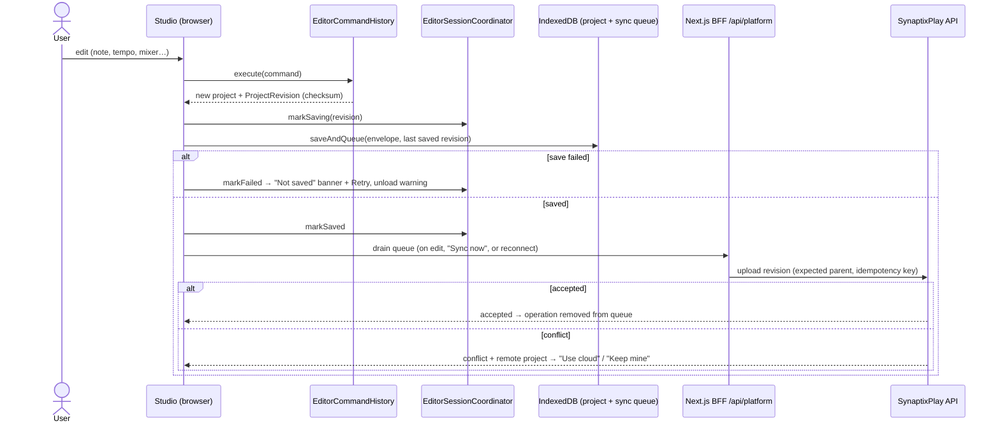
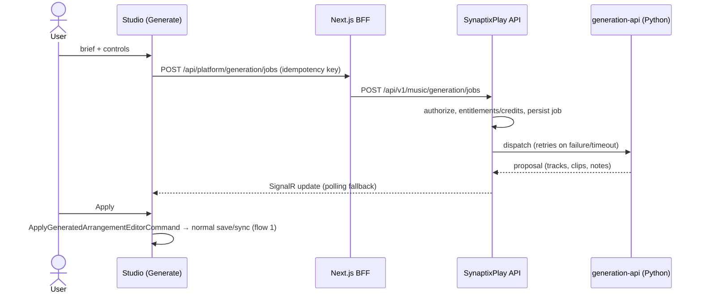
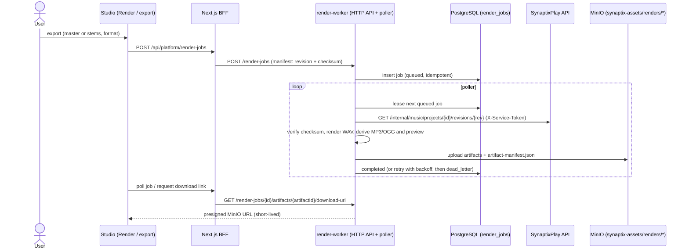

# Core Flows

Sequence diagrams for the three flows that cross service boundaries. Diagrams use Mermaid, which GitHub and most Markdown viewers render.

## 1. Editing and project sync

Every edit is saved locally first; cloud sync is a separate, retryable step.

Only the first browser tab on a project may edit. Later tabs become read-only through a `BroadcastChannel` lease.

## 2. Generation jobs

Applying a proposal is an ordinary undoable edit, and an already-applied job cannot be applied twice.

## 3. Render jobs and export

Completed renders feed adaptive packages. Publication and delivery to games are described in `docs/plans/implementation/stage-13-execution-plan-v1.md`.
