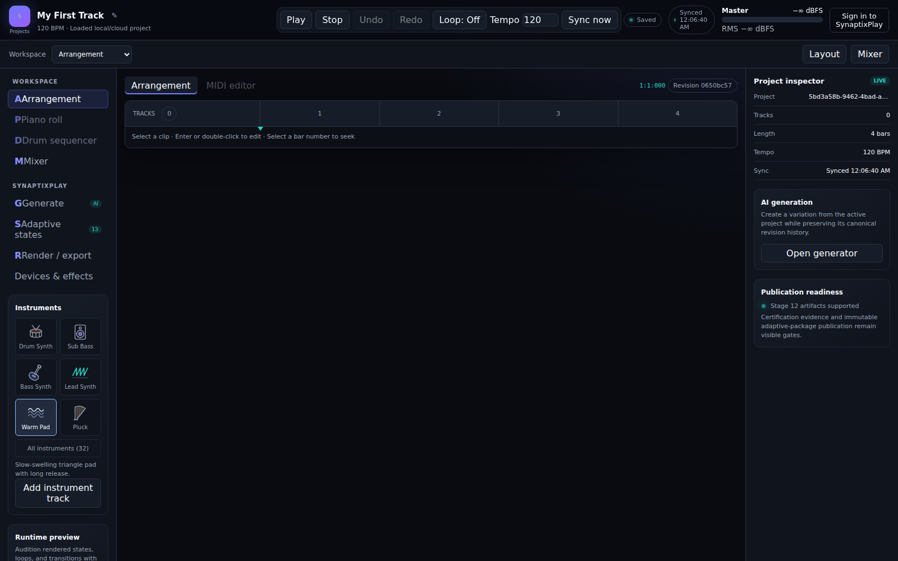
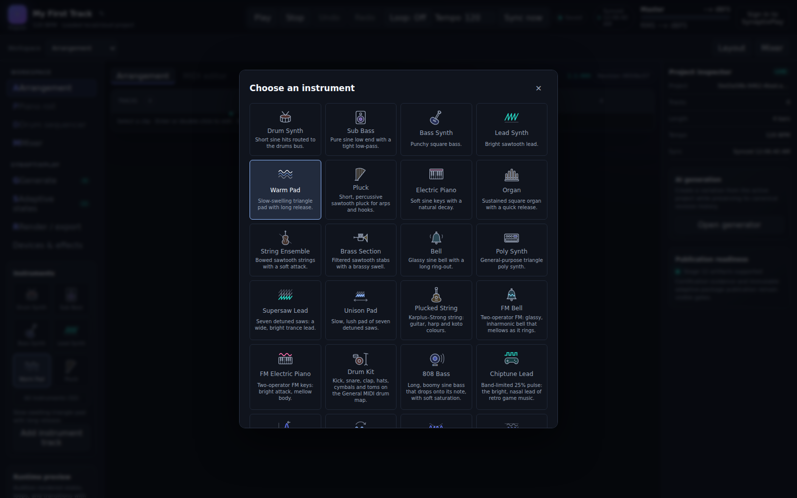
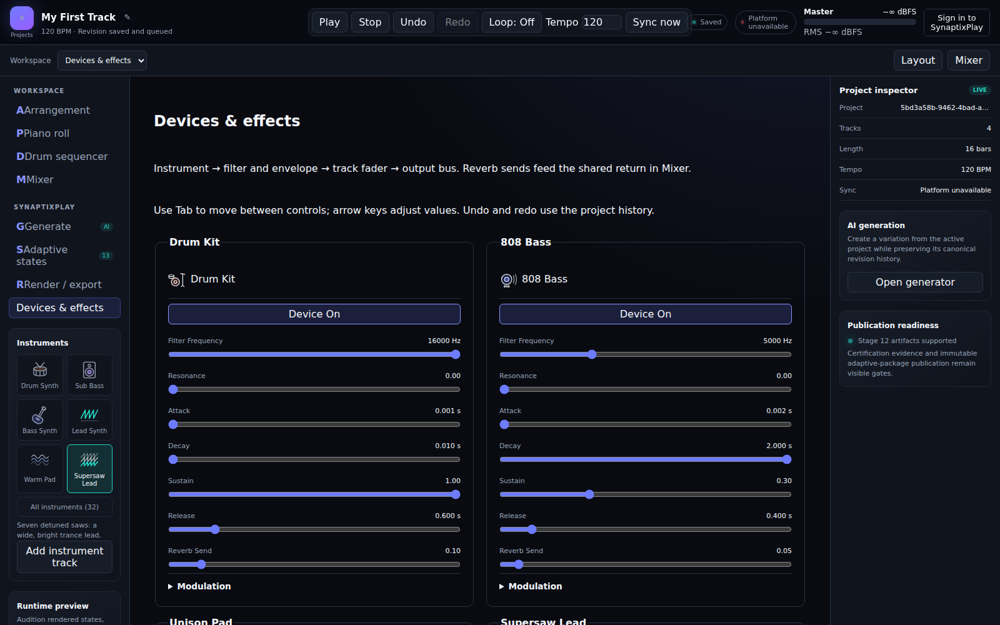
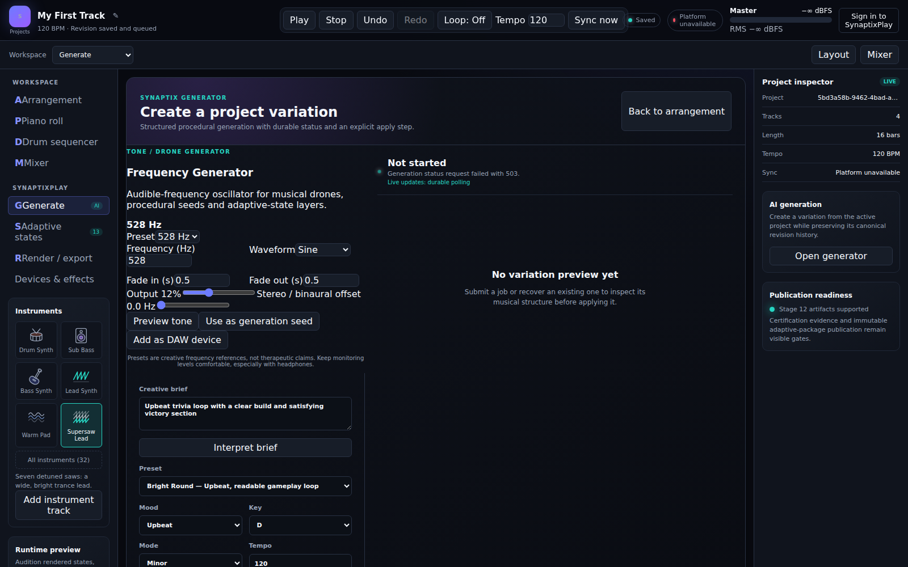
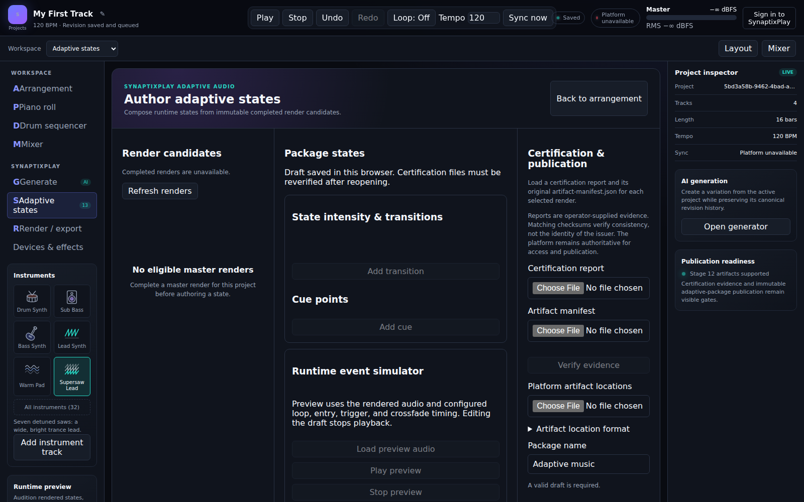
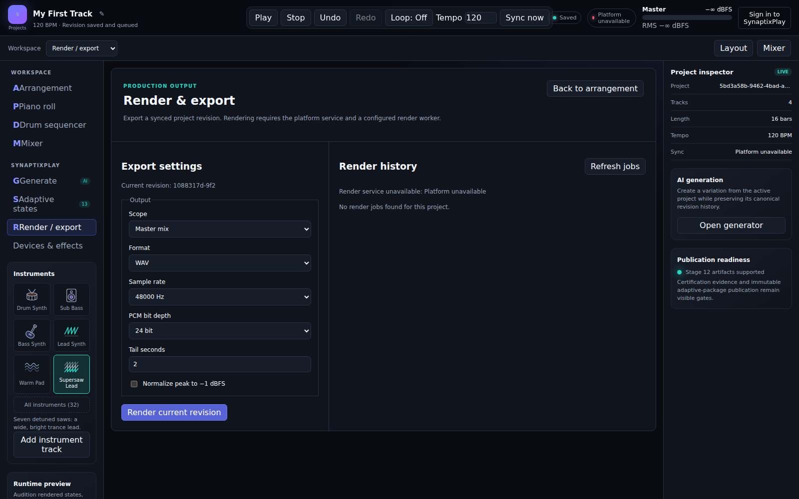
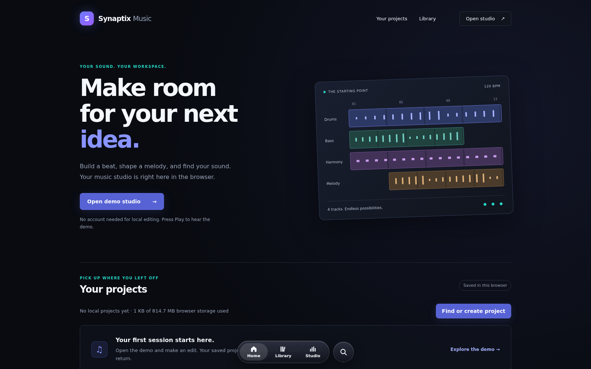

# Studio UI Baseline (October 2026)

**Status (2026-10-10):** Reference. These screenshots show the studio as it stands before the DAW-style redesign. Use them as the "before" for that work. The completed [Studio UI Modernization v1](studio-ui-modernization-v1.md) built this shell.

## How the screenshots were made

A scripted Playwright tour at 1600×1000. It creates a new project called "My First Track" and adds Drum Kit, 808 Bass, Unison Pad and Supersaw Lead from the instrument picker. Then it opens each panel in turn. The platform is offline (its API returns 503), so sync shows "Platform unavailable". The project is new, so nothing has been rendered yet.

## Screens

### New, empty project

### Instrument picker

### Arrangement with four tracks

### Mixer drawer

### Piano roll (Supersaw Lead)

### Drum step sequencer (Drum Kit)

### Devices & effects

### Generate

### Adaptive states

### Render / export

### Home

## What the screenshots show (input for the redesign)

**Navigation**

- Three overlapping ways to move around: the Workspace dropdown, the left sidebar, and the Arrangement / MIDI editor tabs. Several panels also have their own "Back to arrangement" button.
- In the sidebar, each item's letter glyph runs into its label ("AArrangement", "PPiano roll").
- Piano roll and Drum sequencer are sidebar destinations, but they only make sense for the selected clip.

**Arrangement**

- A new project is 4 empty bars over a large blank area, with no hint of what to do first. Adding one instrument with a starter loop stretches the song to 16 bars.
- Track headers have mute, solo, gain and pan as text but no colour, level meter or inline fader. Every clip is the same violet.
- There is no loop region, no markers and no time display other than `1:1:000`.

**Panels**

- The right-hand Project inspector always shows project ID, AI generation and publication readiness. There is no track or clip inspector for what is selected.
- The mixer is a drawer that covers the lower half of the arrangement. Its faders are horizontal sliders, and its meters are text ("Peak Silent · RMS Silent").
- Devices & effects is a separate full-page workspace. There is no device chain beneath the selected track.

**Editors**

- The piano roll toolbar spends two rows on buttons and form fields ("New note pitch", "New note tick"). The keyboard is a list of note names, not piano keys.

**Generate and Adaptive states**

- These are long forms. Generate's frequency-generator block is not laid out on the grid: labels and inputs run together.

**Top bar**

- Transport (Play, Stop, Loop), history (Undo, Redo), tempo, sync and the master meter share one row. There is no record, metronome or time-signature control.

## Video

The tour is also recorded as a WebM video. It isn't checked in, to keep the repository small. To re-record it, run the tour with Playwright's `video: "on"` option.
