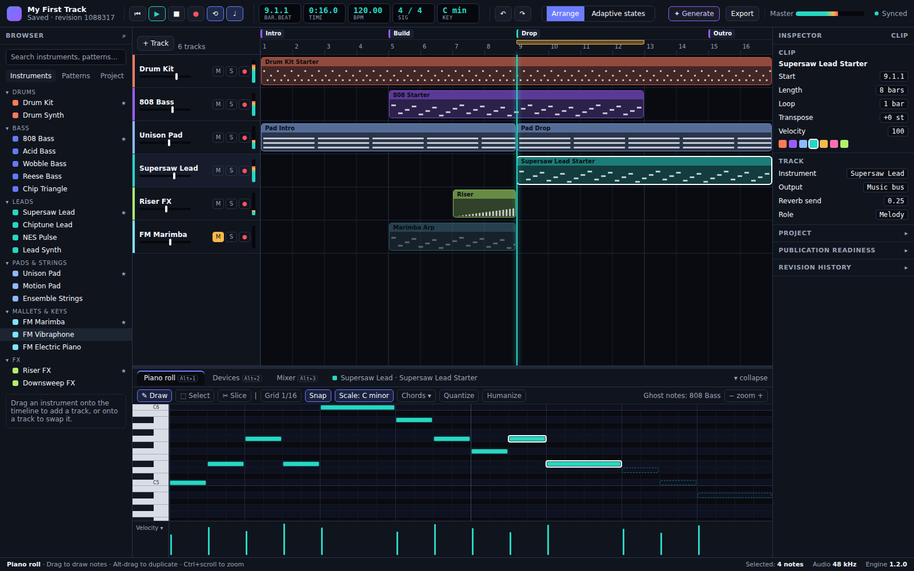
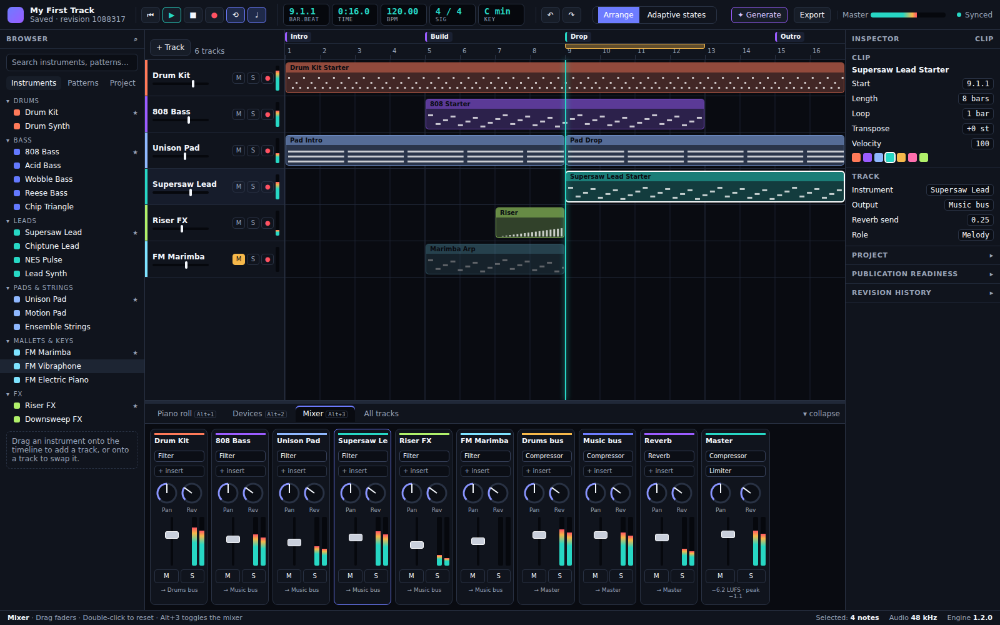
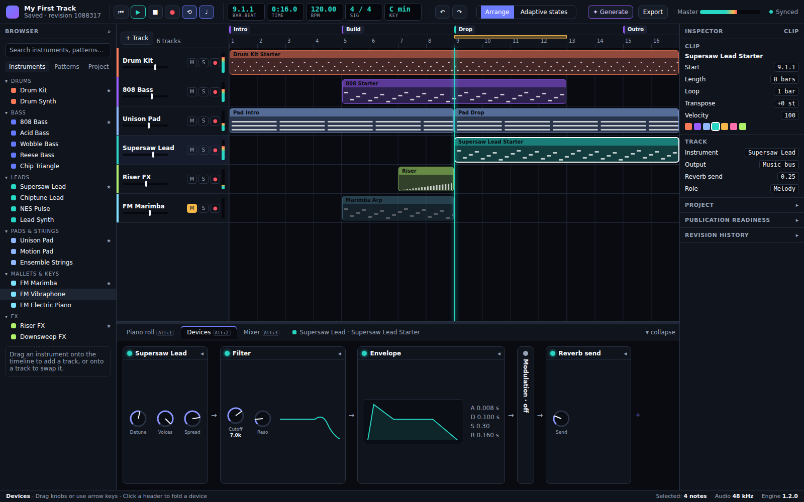
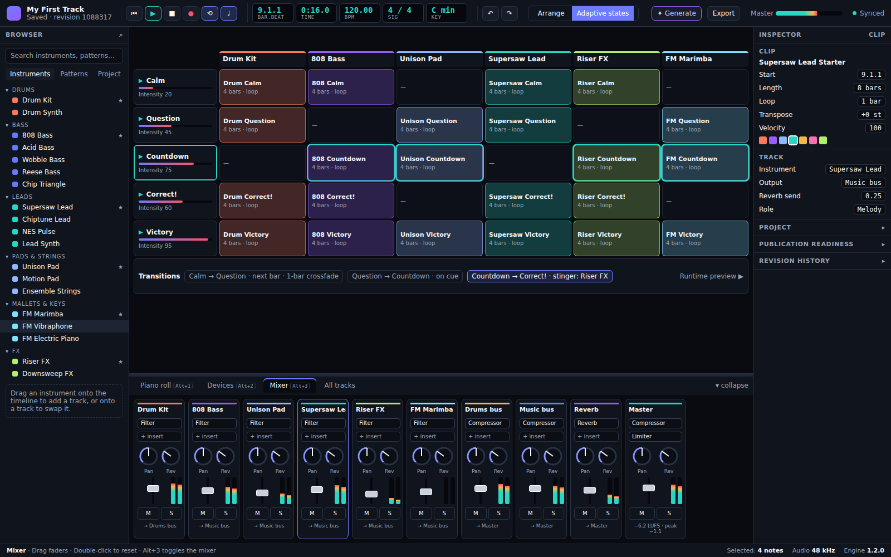

# Studio UI v2: a DAW Layout

**Status (2026-10-10):** In progress. Steps 1–8 are done and v2 sits behind Layout → "DAW layout (preview)"; step 9 (switch over) remains. v1 ([Studio UI Modernization v1](studio-ui-modernization-v1.md)) is still the default studio. The "before" screenshots and the problems this plan fixes are in the [Studio UI baseline](studio-ui-baseline-2026-10.md).

**References:** FL Studio 2026 (2026.1.5, August 2026; [release page](https://www.image-line.com/fl-studio/release/2026)) and Ableton Live 12.4 (12.4.5, August 2026).

## Goal

Make the studio work like a DAW. That means one screen where you arrange, edit, shape sounds and mix without leaving the timeline. Every panel shows what is selected, and the controls you use most are one click or one key away.

The studio is still narrower than a desktop DAW (see the README): generated music, game loops, stingers, adaptive states and exports. v2 changes the layout and controls, not that scope.

## Mockup

An interactive HTML mockup is in [`mockups/studio-ui-v2.html`](mockups/studio-ui-v2.html). Open it in a browser; `?dock=editor|devices|mixer` and `?view=arrange|states` switch the variants. It uses only the studio's existing colour tokens and instrument-family accents.

### Arrange, piano roll docked



### Arrange, mixer docked



### Arrange, device chain docked



### Adaptive states



## What we take from each reference

| Idea                                                                   | From                                                        | In Synaptix                                                                                                                                                                     |
| ---------------------------------------------------------------------- | ----------------------------------------------------------- | ------------------------------------------------------------------------------------------------------------------------------------------------------------------------------- |
| Browser on the left, searchable, grouped, drag onto the timeline       | Both (Live's browser, FL's browser)                         | Instruments grouped by family with their accent colours; Patterns (starter phrases, generator output); Project (clips, renders). Drag to add or swap a track.                   |
| One detail area under the timeline that follows the selection          | Live (Detail View: Clip View and Device View)               | A bottom **dock** with three tabs: Piano roll, Devices, Mixer (Alt+1/2/3). It shows the selected clip or track.                                                                 |
| Device chain left to right, foldable devices                           | Live (Device View)                                          | Instrument → Filter → Envelope → Modulation → Reverb send, each foldable. It replaces the full-page Devices workspace; the Modulation section from #79 becomes a folded device. |
| Channel-strip mixer with insert slots, sends and vertical faders       | FL (Mixer) and Live (Mixer)                                 | A strip per track, plus drums bus, music bus, reverb return and master. Meters use the existing `ChannelMeters`.                                                                |
| Piano roll with real keys, scale highlighting, chord help, ghost notes | Live 12 (scale awareness), FL (Chord panel and ghost notes) | Real keys; the project key and scale shade in-scale rows; a Chords menu; ghost notes from one other track.                                                                      |
| Step sequencer for drums                                               | FL (Channel Rack)                                           | The existing drum sequencer, opened automatically in the dock for drum tracks.                                                                                                  |
| Session grid of clips × scenes                                         | Live (Session View)                                         | The **Adaptive states** view: tracks are columns, states are rows (scenes) with intensity, plus a transitions strip. It replaces the form-based workspace.                      |
| Transport with position counters, loop and metronome                   | Both (Live's Control Bar, FL's toolbar)                     | One bar: transport, position (bars.beats and time), tempo, time signature, key, undo/redo, view switch, Generate, Export, master meter, sync.                                   |
| Hint bar                                                               | FL (hint bar)                                               | A status bar that names the hovered control and its shortcut, with save and engine status on the right.                                                                         |
| Built-in learning                                                      | Live 12.4 (Learn View)                                      | Not in v2. The empty-project state links to a short "first beat" walkthrough instead.                                                                                           |
| Assistant that edits the project                                       | FL 2026 (Gopher)                                            | Not in v2. **Generate** stays as it is (procedural plans, and composed plans that now use the new instruments), opened from the transport bar as a drawer.                      |

**Not copied on purpose:**

- FL's floating, overlapping windows. v2 uses fixed, resizable docks so keyboard and screen-reader order stays predictable.
- FL's pattern and playlist split. Clips stay on tracks, as now.
- Recording and audio clips. The studio has no audio input today; the record button arms MIDI step input only.

## Layout

```
┌ Transport: ⏮ ▶ ■ ● ⟲ ♩ │ 9.1.1 │ 0:16.0 │ 120 │ 4/4 │ C min │ ↶ ↷ │ Arrange | Adaptive states │ ✦ Generate  Export  Master ▮▮▮  ● Synced ┐
├ Browser ─────┬ Markers  Intro │ Build │ Drop │ Outro ───────────────────────┬ Inspector ───┤
│ Search       │ Ruler    1  2  3  4 … [loop brace]                          │ Clip         │
│ Instruments  ├ Track headers ─┬ Lanes (coloured clips, playhead) ───────────┤ Track        │
│  Drums       │ ■ Drum Kit M S ●▮ │ ███████████████████████████████            │ ▸ Project    │
│  Bass …      │ ■ 808 Bass  M S ●▮ │       ███████████████                       │ ▸ Publication│
│ Patterns     ├───────────────┴──────────────── splitter ─────────────────┤ ▸ History    │
│ Project      │ Dock: [Piano roll | Devices | Mixer] · selected clip/track      │              │
│              │ (editor, device chain or channel strips)                     │              │
├ Status bar: hint for the hovered control ······················· Selected · 48 kHz · Engine 1.2.0 ┤
```

- **Transport bar (48 px).** One row with everything that controls playback or the whole project. It replaces the v1 top bar, the Workspace dropdown, and the sidebar's navigation list.
- **Browser (left, 232 px, resizable, collapsible).** Instruments, Patterns and Project. It replaces the sidebar instrument picker, the "All instruments" modal and the runtime preview card.
- **Timeline (centre).** A section-marker lane, a ruler with a loop brace, then tracks. Each track header has its family colour, name, a mini fader, mute/solo/arm and a level meter. Clips take the track's colour; muted tracks are dimmed.
- **Dock (bottom, resizable 180–640 px, collapsible).** Piano roll / step sequencer, Devices and Mixer, always about the selection. Selecting a drum clip opens the step sequencer.
- **Inspector (right, 248 px, resizable, collapsible).** Selected clip (start, length, loop, transpose, velocity, colour) and track (instrument, output, send, role). Project, publication readiness and revision history fold below.
- **Status bar (24 px).** A hint naming the hovered or focused control, plus save state, sync state, Sync now and project facts (revision, tracks, bars). Save and sync moved here from the transport bar so the bar fits on one row at 1440 px.
- **Views.** Arrange and Adaptive states, switched in the transport bar (Alt+S). Live uses Tab, but in a browser Tab moves keyboard focus. Render/export becomes a dialog opened from **Export**. Generate becomes a right-hand drawer opened from **✦ Generate**.

## Keyboard

| Key           | Action                                                                                                   |
| ------------- | -------------------------------------------------------------------------------------------------------- |
| Space         | Play / stop (existing)                                                                                   |
| Alt+S         | Arrange ↔ Adaptive states                                                                               |
| Alt+1 / 2 / 3 | Dock: Editor (piano roll or step sequencer) / Devices / Mixer (pressing the open tab collapses the dock) |
| Ctrl/Cmd+B    | Toggle browser                                                                                           |
| Ctrl/Cmd+I    | Toggle inspector                                                                                         |
| L             | Loop the selection                                                                                       |
| M / S         | Mute / solo the selected track                                                                           |
| Ctrl/Cmd+E    | Export dialog                                                                                            |

Existing editor shortcuts (copy, paste, duplicate, quantize, nudge) are unchanged. F-keys are not used, because browsers reserve several of them.

## Constraints

Carried over from v1:

- Visual components never change the canonical project directly. Every edit is still an editor command with undo and redo.
- Commands, history, persistence and sync stay authoritative.
- Audio nodes stay browser-only and lifecycle-managed.
- Every control works by keyboard and screen reader. axe stays clean (WCAG 2.1 AA).
- Visual regression baselines accompany each shell and editor change.

New for v2:

- No new colours. Track and clip colours come from the instrument-family accents; everything else uses the existing `--sx-*` tokens.
- v2 ships behind a layout switch (`studio-layout:v2` in the existing layout preferences) until it reaches parity. Then v1 is removed in one PR.
- No engine changes. The dock, mixer and meters reuse `PianoRoll`, `DrumStepSequencer`, `renderDeviceControls`, `MixerDrawer` and `ChannelMeters` logic. The work is layout and presentation.
- Tablet (1024 px): browser and inspector collapse to toggles, and the dock becomes a bottom sheet. Phone (≤760 px) keeps today's single-column fallback.

## Ordered work

Each step is one PR with its own visual baselines and UI tests.

1. **Split `StudioClient.tsx`.** **Done.** It was 982 lines with large inline JSX. The top bar, banners, view bar, sidebar, inspector and device controls are now components (`StudioTopbar`, `StudioBanners`, `StudioViewbar`/`StudioSidebar`, `StudioInspector`, `DeviceControls`/`DevicesWorkspace`), with no visual change. `StudioClient.tsx` is down to 734 lines. The `layout: "v1" | "v2"` switch moves to step 2, which is the first step to use it.
2. **v2 shell.** **Done.** Add `layout: "v1" | "v2"` to `use-studio-layout`, then build behind it: the CSS grid (transport, browser, timeline, dock, inspector, status bar). The dock hosts the existing editors as they are, and the transport bar takes over the Workspace dropdown and sidebar navigation. This also fixes the glyph-and-label run-on ("AArrangement"). **Done when** every v1 workspace is reachable in v2 by mouse and keyboard, and axe is clean.
3. **Timeline.** Delivered in two parts.
   - **3a, done:** family-coloured track headers and clips (the colour follows what the track plays as, resolved like the audio engine does), a level meter in each header, dimmed muted tracks, compact rows, bar.beat and time counters in the transport bar, and an empty-project prompt that adds the chosen instrument. All of it is only in the DAW layout (`variant="daw"`). Dropped from the original list: the header mini-fader (volume is one Alt+3 away in the dock's mixer) and the arm button (there is no recording to arm). The "first beat" walkthrough link is also dropped, since no walkthrough exists.
   - **3b, done:** the loop brace (drag to set it, L to loop the selection) and the section-marker lane. Both are commands with undo, using the schema's existing `transport.loopRange` and `markers`.
   - **Done when** loop and markers are commands with undo, and meters animate during playback.
4. **Dock: Piano roll.** Delivered in two parts.
   - **4a, done:**
     - **Keyboard:** keys look like a keyboard (black keys shorter, C rows labelled).
     - **Toolbar:** one row (Preview, Grid, Snap, Scale, Chords, Quantize, an Edit menu with the clipboard, transpose and delete actions, compact zoom). The "New note pitch/tick" fields are gone, since drawing on the grid replaces them.
     - **Scale shading:** shades the rows in the key.
     - **Chord Panel** (from FL Studio 2026): a lane naming the chords along the clip, and the chord of the selected notes.
     - **Key setting:** the project model has no key, so the scale is a per-project view setting remembered in the browser. It defaults to **Auto**, which detects the key from the clip's notes (`lib/editor/music-theory.ts`). This avoids a schema change across TypeScript, JSON Schema and Python.
     - Drum clips keep their drum names and get no scale or chords. All of this is in the DAW layout only.
   - **4b, done:**
     - **Tools:** Select/Draw (in Draw one click adds a note; **B** switches).
     - **Ghost notes:** another track's notes shown faintly behind the clip.
     - **Humanize:** a seeded, undoable nudge of timing and velocity (`HumanizeMidiNotesCommand`).
     - **Labels:** a toggle that writes each note's name on it.
     - FL Studio 2026's _renamable_ note labels would need a note field in the project schema, so they go with the key schema change below.
   - **Project key, done (decided 2026-10-10):** the key is project data and travels with the project.
     - **Schema:** optional `key: { tonic: 0–11, mode }` in TypeScript/Zod, both JSON Schemas and both Pydantic models. It is absent when unset, so existing projects keep their checksums.
     - **Editing:** `SetProjectKeyEditorCommand` sets or clears it with undo, and applying a generated arrangement sets it from the generator's key.
     - **Piano roll:** choosing a key saves it to the project; Auto clears it and falls back to detection; Off stays a per-browser display choice.
     - **Platform backend:** stores projects as opaque JSON, so it needed no change.
   - **Done when** current piano-roll tests pass, and new ones cover the scale and chord tools.
5. **Dock: Devices.** **Done.** The Devices tab shows one track's chain, left to right:
   - **Devices:** Instrument (icon, on/off), Filter, Envelope (with an ADSR drawing), Modulation (folded unless in use; shares the classic panel's fold state), Reverb send, then the track's plug-in inserts. Drone tracks show their drone controls.
   - **Track:** a Track picker, which follows the clip being edited.
   - **Knobs** (`components/ui/Knob.tsx`, `role="slider"`): drag up and down, use the arrow keys or Page Up/Down, Home/End, or double-click to reset to the instrument's default. Each gesture is one command, the same one the classic sliders send. Cutoff moves logarithmically.
   - The classic Devices page stays until step 9; the DAW layout no longer reaches it. Every parameter is reachable in the chain.
6. **Dock: Mixer.** **Done.** The Mixer tab shows channel strips (`DockMixer.tsx`), left to right:
   - **Track strips:** colour, name, insert slots (the instrument then its plug-ins; choosing a slot opens that track in Devices), Pan and Send knobs, a vertical fader with a peak-and-RMS meter, mute/solo, and the output route.
   - **Buses:** Music, Drums and the Reverb return, each with a fader, meter and mute. **Master** shows peak and RMS, with a fader and mute.
   - **Edits:** each gesture is one command, the same ones the classic drawer sends.
   - The drawer's in-dock mode is removed; the drawer itself stays for the classic layout until step 9. The step-6 UI test covers what `mixer.spec` covers for the drawer (fader undo, pan, mute/solo, routing, master, axe).
   - **Renamable note labels, done after step 7 (requested 2026-10-10):** FL Studio 2026's note labels.
     - **Schema:** an optional per-note `label` (1–32 characters) in TypeScript/Zod, both JSON Schemas and both Pydantic models. It is absent when unset, so existing projects keep their checksums.
     - **Editing:** `SetMidiNoteLabelCommand` names or clears the selected notes as one undo step; v2 projects run it through `liftEditorCommandToV2`. Copy and paste keep a note's label.
     - **Piano roll (DAW only):** a **Rename** menu next to **Labels** names the selected notes (a blank name or **Clear label** removes it). With **Labels** on, a note shows its label, else its pitch.
7. **Browser and inspector.** **Done.** The DAW layout's Browser (`StudioBrowser.tsx`) has three tabs:
   - **Instruments:** search (name, description or family) over the whole catalog, grouped by family. Click chooses; **Enter** or double-click adds a track; **Shift+Enter** swaps the selected clip's track. Drag onto a track to swap it, or elsewhere on the timeline to add one. Add and Swap buttons do the same.
   - **Swap** is a new undoable command (`SwapInstrumentEditorCommand`): the sounding device becomes the new instrument with default settings and a new device id. A track still named after its instrument takes the new name.
   - **Patterns:** adds the chosen instrument's starter phrase to the selected clip's track as a new clip, then opens it; Generator output opens the generator.
   - **Project:** the project's clips by track (choosing one opens it in the dock); Renders points to Export, which lists them.
   - **Inspector:** follows the timeline selection (else the clip being edited) with the clip's and its track's facts above the project facts.
   - **Tests:** the instrument-picker test is ported (catalog listed, search and description, Enter adds); new tests cover swap, drag, undo, starter phrases and the Project list. The classic picker and its test stay until step 9. The inspector is hidden at tablet width, so the test that uses it is desktop-only.
8. **Adaptive states, Generate, Export.** **Done.** All three are in the DAW layout only:
   - **Adaptive states (Alt+S):** a Session-style grid (`table` "States grid"). Each row is a state: name, role and an intensity bar, then its render, loop, entry and exit cues, and the states it leads to. Below it, a transitions strip lists each transition (trigger and crossfade) and cue point. Choosing a row edits that state underneath, beside the render candidates and publication. The runtime preview lights the row that is playing.
   - **Not like the mockup:** the mockup had a column per track with a clip slot in each. A state is a whole-mix master render, and the adaptive manifest has no per-track content, so those cells would always be empty. The grid's columns are the state's own data instead.
   - **Generate** opens a right-hand drawer over the inspector, so the arrangement stays in view. **Export** (or Ctrl/Cmd+E) opens a modal dialog. Escape or Close shuts either one and returns focus to the button that opened it.
   - **Tests:** the adaptive authoring, generation (including prototype audio) and export UI tests now run in both layouts (`tests/ui/layouts.ts`), and step 9 drops the classic runs. A new baseline covers the states grid on desktop and tablet; the graph editor is the same component in both layouts and keeps its classic baseline.
9. **Switch over.** v2 becomes the default, v1 code and baselines are removed, and the README screenshots, baseline doc and changelog are updated.

## Risks

- **Big-file refactor (step 1).** Mitigation: step 1 changes no behaviour or visuals, so the existing UI tests and baselines are the safety net.
- **Baseline churn.** Every step moves pixels. Mitigation: one PR per step, and baselines updated only in the PR that changes them.
- **Meter performance.** Many animated meters could cost frames. Mitigation: one `requestAnimationFrame` loop reads `ChannelMeters` snapshots and writes CSS variables, with no React re-render per frame.
- **Drag and drop accessibility.** Mitigation: every drag has a keyboard command and a visible button.
- **Tablet layout.** The three-column grid doesn't fit at 1024 px. Mitigation: collapsing panels and a bottom sheet, tested at the existing tablet visual size.
- **UI test memory.** Locally the full suite gets killed for memory. Mitigation: CI runs it in full; locally, run per spec with one worker.

## Acceptance criteria

- One screen arranges, edits, shapes and mixes; no task needs a full-page workspace switch except Adaptive states.
- Every panel shows the selection: the dock and inspector update when a clip or track is selected.
- Keyboard-only use covers everything in the Keyboard table. axe is clean on every view.
- Meters animate in the timeline headers and mixer during playback.
- Existing project files open unchanged; v2 changes no stored data except layout preferences.
- Visual baselines exist for Arrange (each dock tab) and Adaptive states, on desktop and tablet.

## Revision

- 2026-10-10: first version, with an HTML mockup and four rendered variants.
- 2026-10-10: step 1 done. Added the FL Studio 2026 Chord Panel and note labels to step 4, and moved the layout switch to step 2.
- 2026-10-10: step 2 done. The shell sits behind Layout → "DAW layout (preview)". Its parts:
  - **Transport bar:** play, stop, loop, position, tempo, undo/redo, the Arrange / Adaptive states switch, Generate, Export, Layout, master meter and account.
  - **Browser:** the instrument picker.
  - **Centre:** the timeline over a resizable, collapsible dock (Editor / Devices / Mixer).
  - **Inspector** and a **status bar** with hints, save and sync.
  - **Choices:** shell, dock tab, height and open state persist; Reset layout keeps the shell choice; phones stay on v1.
  - **Fixes:** the view-switch key is Alt+S, and the v1 sidebar's glyph run-on is fixed.
- 2026-10-10: step 3a done (coloured timeline, header meters, counters, empty-project prompt). Step 3 is split into 3a and 3b, and the mini-fader, arm button and walkthrough link are dropped.
- 2026-10-10: step 3b done. Added a marker lane and a loop lane above the ruler:
  - **Markers:** add at the playhead; click to jump; double-click or F2 to rename; Delete to remove.
  - **Loop:** drag across bars to set it; L loops the selected clip; × clears it. A loop that is switched off still shows as a dashed brace.
  - **Undo:** new `SetLoopRegionEditorCommand` and `SetMarkersEditorCommand` make each change one undo step.
  - **Account:** the account control moved to the status bar so the transport bar stays on one row.
- 2026-10-10: step 4a done (DAW piano roll: keyboard, one-row toolbar, scale shading, Chord Panel). The key is a view setting with auto-detect rather than project data.
- 2026-10-10: step 4b done (tools, ghost notes, humanize, labels). The project owner decided the key should be project data; that work is scheduled after step 5.
- 2026-10-10: step 5 done (device chain with knobs in the dock).
- 2026-10-10: the project key is project data (schema, command, generator, piano roll).
- 2026-10-10: step 6 done (mixer channel strips in the dock). Renamable note labels are scheduled after step 7.
- 2026-10-10: step 7 done (Browser with search, families, add/swap/drag, Patterns and Project tabs; the inspector follows the selection). Renamable note labels are next.
- 2026-10-10: step 8 done (states grid with transitions strip, Generate drawer, Export dialog). The grid's columns are the state's own data rather than the mockup's per-track clip slots, which have no data behind them.
- 2026-10-10: renamable note labels done (schema field, `SetMidiNoteLabelCommand`, the piano roll's Rename menu).
